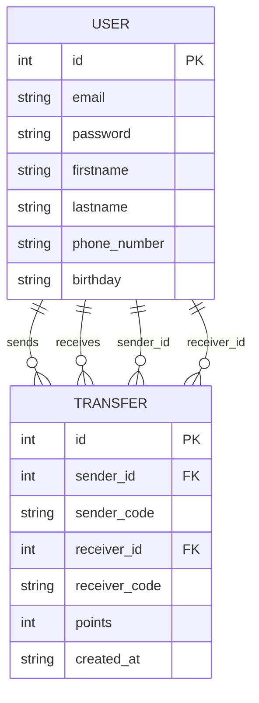

// All DB logic is now refactored to use receiver pattern via TransferDB struct
// Service layer uses TransferDB for all transfer-related queries
// Data dictionary and ER diagram are documented in docs/database.md
// Last update: 2025-08-27
// Author: alongkorn.c

# Database ER Diagram (Mermaid)

---

## Data Dictionary

### USER
| Field        | Data Type | Key Type   | Example           |
|--------------|-----------|------------|-------------------|
| id           | int       | PK         | 1                 |
| email        | string    | Unique     | user@email.com    |
| password     | string    |            | $2a$10$...        |
| firstname    | string    |            | John              |
| lastname     | string    |            | Doe               |
| phone_number | string    |            | 0812345678        |
| birthday     | string    |            | 1990-01-01        |

### TRANSFER
| Field        | Data Type | Key Type   | Example           |
|--------------|-----------|------------|-------------------|
| id           | int       | PK         | 101               |
| sender_id    | int       | FK         | 1                 |
| sender_code  | string    |            | user@email.com    |
| receiver_id  | int       | FK         | 2                 |
| receiver_code| string    |            | friend@email.com  |
| points       | int       |            | 50                |
| created_at   | string    |            | 2025-08-27        |
